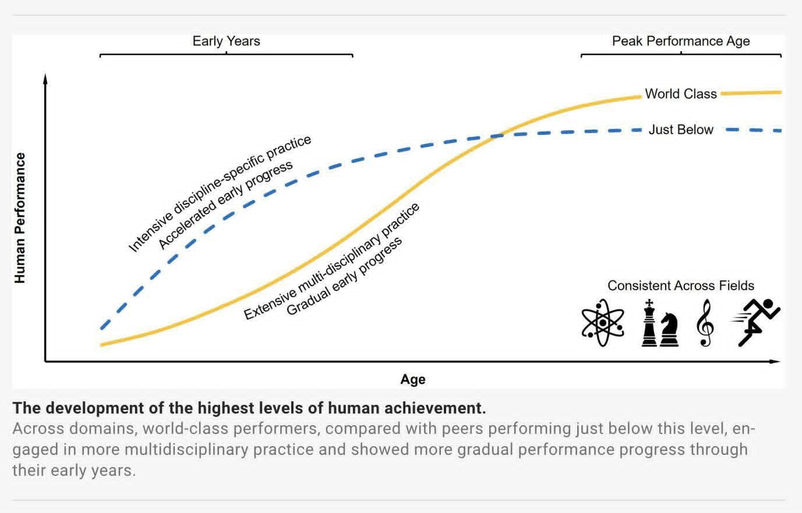
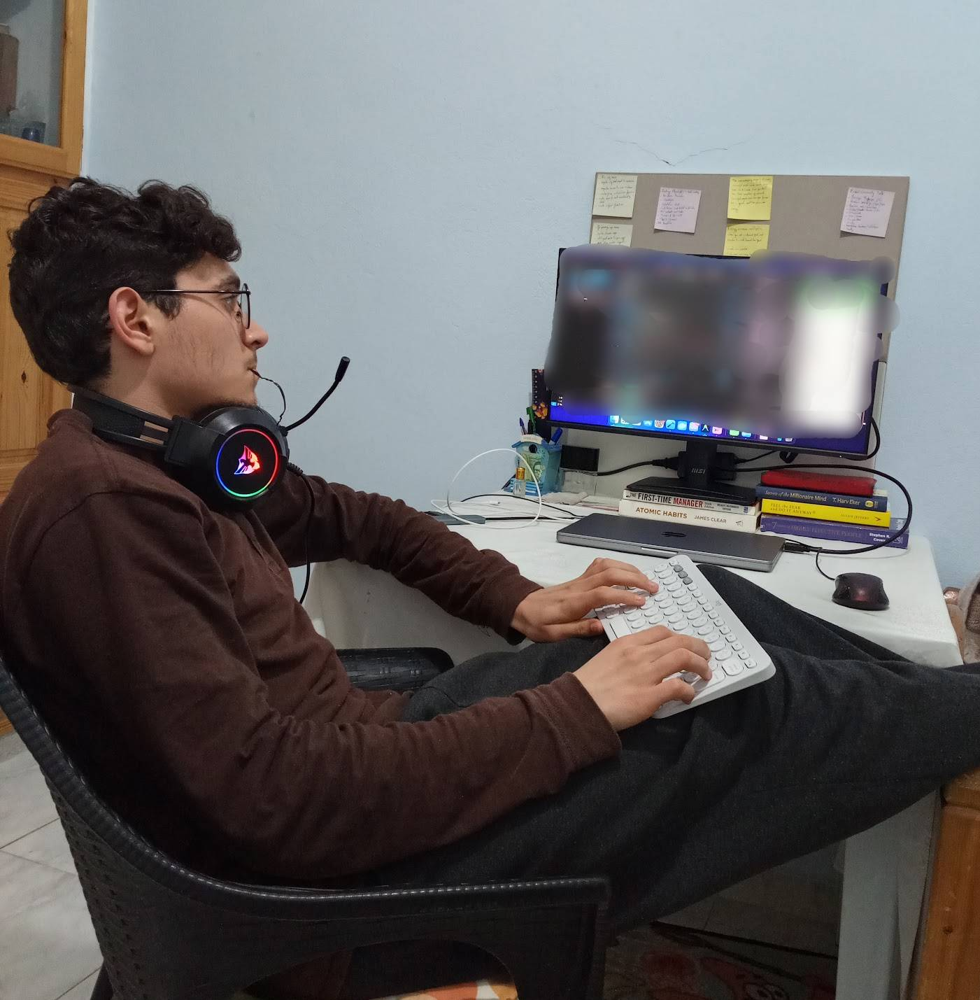
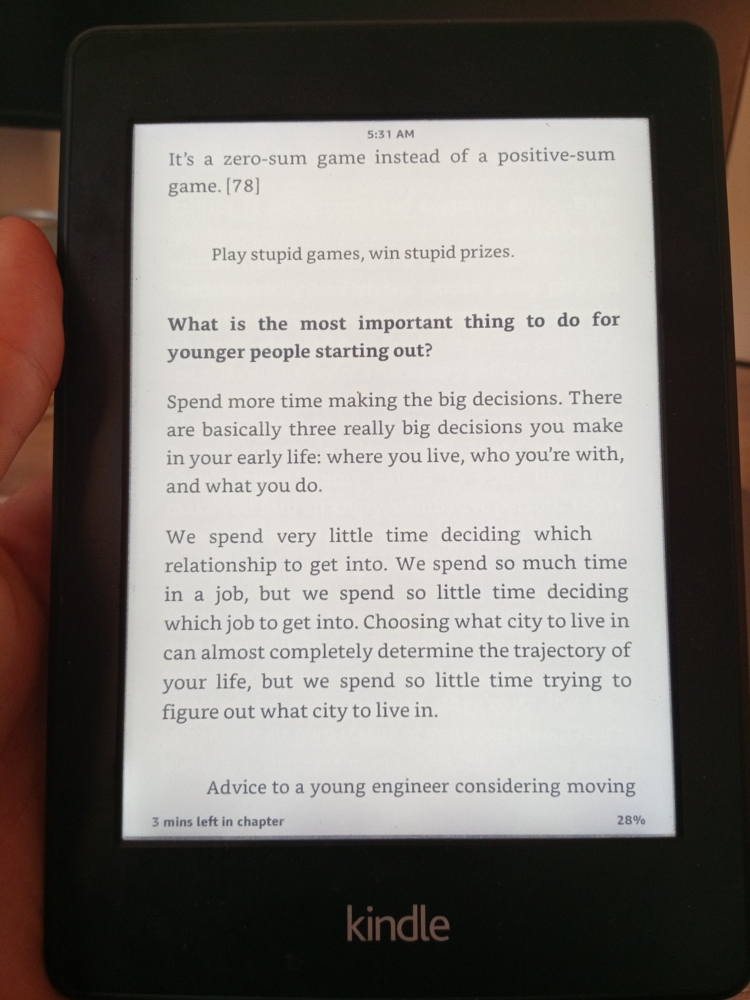

hey, what's up?
welcome to my blog. this is my corner on the internet where no algorithm decides who sees this, no platform can shadow-ban it, no company can shut it down, and nobody can read it as well. It's mine, and this is the weird opening post.

if you know me in real life, then you probably know that i'm not a very talkative person by default unless we get comfortable together first. i used to listen more than i speak, since my teens, for some reason that we'll talk about in a future blog post.

but if you know me really deeply, you'll know that having a deep discussion together would be unforgettable. you have to spend a good time with me to unlock my other personality *($9.99/month, paid yearly)*

anyway, the main thing that triggered me to start this blog is that i have a lot of thoughts and ideas that live in my head rent-free and i wanna share them here, i don't care that much if it's read or not, but at least i can feel better when i write them down.

I ain't impressing or flexing. I sometimes share stuff on youtube to delete later when I feel like it.

Looking back, I realize that many parts of my life were far from ordinary. I rarely had average in/outcomes, everything i experienced was way different from what the majority of people are doing.

***Thought for 3 seconds ...***

i'm not being egoistical here, don't get me wrong. or if you do, then you can simply click on the 3 dots on top-right and block me.

oh sh*t, it's my blog! you can't do it.

***Continuing ...***

i'm a guy who had an uncommon path in life.
in other words, God gave me a lot of blessings in life: i grew up in a protective family, i discovered my passion really early *(in which i will break down in a dedicated blog post so you read it before having new children)*, i was surrounded by so many talented and great people since i'm 12. They were my mentors and that was a huge step in my life that put me 10+ years ahead, or maybe even more.
I was sitting in rooms where people were discussing things I didn't even know existed.
i'm super grateful for all the blessings that god gave me, and saved me from following unwanted paths. thank god for the guidance.

gratefully, i experienced many things in life early: work, experience, and much more so i let you discover on your own.
as i said, i was surrounded by a lot of great people who contributed to shaping the current version of me.
many people invested in me, directly or indirectly. anyway, i'm thankful for all of them.
since i can't give back to them, i'm trying to do the same thing in life so i do my best to help others whenever i can.

i'm not claiming to be a wise person, or someone who unlocked the dragon level. i'm still early in life, i still don't know anything, and i still see myself so far from where i'm supposed to be, so trust my baby steps.

by the way, something worth mentioning is that my dad is an exceptional person. he's not a programmer, not an engineer, but someone who's engineering-minded.
he played an important role on shaping the person iam today.
dad didn't just teach me something specific, but he taught me a much more important lesson: "How to Think".

i remember one time when i was 14, we were both on the same room for 3-4 hours. he was using the computer, and i was building dummy a hardware project. to be honest, i had no plan at that time, and he knew that. i just collected a lot of garbage and tools, and started playing with them, with no idea about where iam now, where i want to go, and what it takes to go there.

he didn't even react, but instead he let me do my stupid thing for 3 hours straight then got back to me and said "So, what's new?"

the innocent me, said: "All good, still trying out things"

and we had the following conversation

> - Dad: "Nah, kid. you won't do it, there's a bigger problem"
> - Me: "Weird, can you tell me about it?"
> - Dad: "It's simple: you have no plan"
> - Me: (interrupted)
> - Dad: "Think and don't work, not Work and don't think"

Finally, he mentioned the following quote:

> « Il faut penser avant d'agir. »

***"One must think before acting."***

then he left the room.

That conversation kept me speechless for few minutes because it was a bit bigger than what my small mind can compile at a time.
But it shifted my thinking forever.

Anyway, he invited me to the garage and gave me the missing piece of cake and we had fun together building my weird invention.

<video controls>
  <source src="/media/own-your-corner-of-the-internet/mar-20-2018-video.mp4" type="video/mp4">
  Your browser does not support the video tag.
</video>

I think you now started to enjoy the blog post, right?
Good, let's continue.

Since I was 14, my dad's vision towards me was simple: "Aziz, do your thing."
it might sound harsh a little bit, but it's totally the opposite.

He let me do my thing freely, no pressure. explore things on your own, own the responsibility of your decisions, and "let me know if you need any help."

I wish more parents would change their mindset: stop being overprotective and stop trying to eliminate every mistake their kids might make. By doing so, they often unintentionally create a dependency instead of teaching independence.

Anyway, I might dedicate another blog post about raising children huh.

fast forward, things started changing really quickly. I'm going to document them here from time to time.

This blog is mainly for the teenage version of me, and the future generations if so.

I sometimes get asked technical questions, and over the years I've realized that I genuinely enjoy explaining things. People often tell me I'm good at making complex ideas easier to understand. So, instead of keeping those conversations one-on-one, I want to share them on a larger scale through this blog.

I'm not going to write my life story, but only trying to give you a glimpse of the kind of things you'll read about in the future posts.

This blog will contain various posts of different topics: from experiences i had, lessons i wish i knew earlier, coding tips, thoughts and more ...

I don't want this blog to be a place where I pretend to have everything figured out. I'm not here to teach from a mountain. I'm here to document the climb.

All these experiences shaped the way I see things today. The way I approach problems, the way I build things, the way I learn, and the way I think.

This blog is basically a public notebook of my humble journey, mainly for myself.

Expect weird things. it will probably make no sense until years later.

Random image:

See you in the next one.